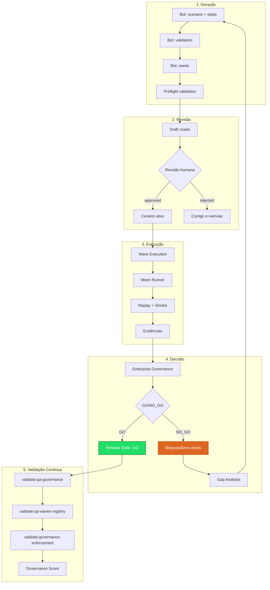

```mermaid
flowchart TD
    subgraph Generation["1. Geração"]
        direction LR
        A1[Bot: scenario + steps] --> A2[Bot: validators]
        A2 --> A3[Bot: seeds]
        A3 --> A4[Preflight validation]
    end

    subgraph Review["2. Revisão"]
        direction LR
        B1[Draft criado] --> B2{Revisão humana}
        B2 -->|approved| B3[Cenário ativo]
        B2 -->|rejected| B4[Corrigir e reenviar]
    end

    subgraph Execution["3. Execução"]
        direction LR
        C1[Wave Execution] --> C2[Mesh Runner]
        C2 --> C3[Replay + Smoke]
        C3 --> C4[Evidências]
    end

    subgraph Governance["4. Decisão"]
        direction LR
        D1[Enterprise Governance] --> D2{GO/NO_GO}
        D2 -->|GO| D3[Release Gate: GO]
        D2 -->|NO_GO| D4[Bloqueadores ativos]
        D4 --> D5[Gap Analysis]
        D5 --> A1
    end

    subgraph Validation["5. Validação Contínua"]
        direction LR
        E1[validate:qa-governance] --> E2[validate:qa-waves-registry]
        E2 --> E3[validate:governance-enforcement]
        E3 --> E4[Governance Score]
    end

    A4 --> B1
    B3 --> C1
    C4 --> D1
    D3 --> E1

    style D3 fill:#2d6,stroke:#151,color:#fff
    style D4 fill:#d62,stroke:#a51,color:#fff
```
