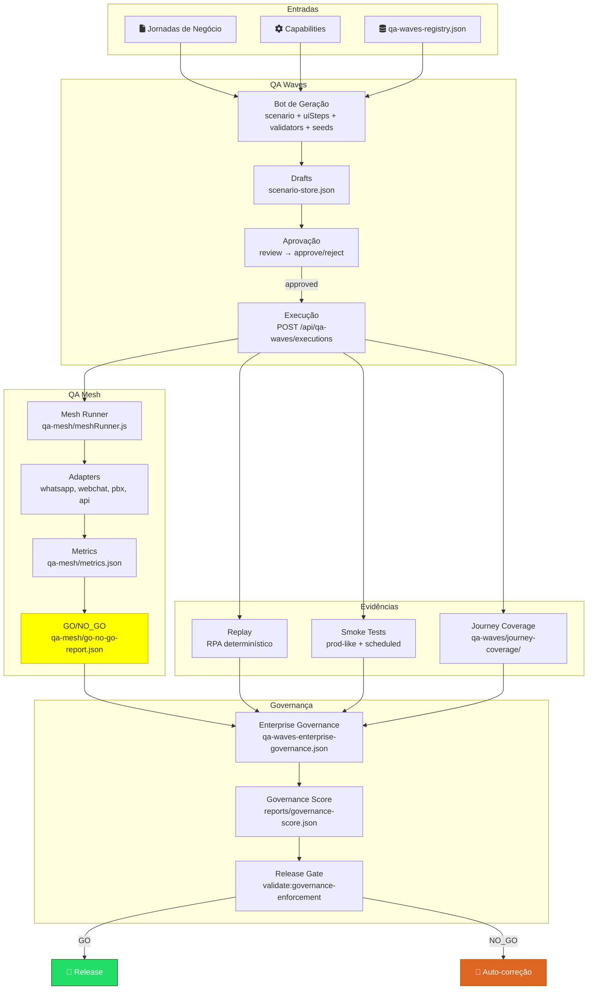

```mermaid
flowchart TD
    subgraph Inputs["Entradas"]
        J[fa:fa-file Jornadas de Negócio]
        C[fa:fa-gear Capabilities]
        R[fa:fa-database qa-waves-registry.json]
    end

    subgraph Waves["QA Waves"]
        GEN[Bot de Geração\nscenario + uiSteps + validators + seeds]
        DRAFT[Drafts\nscenario-store.json]
        APPR[Aprovação\nreview → approve/reject]
        EXEC[Execução\nPOST /api/qa-waves/executions]
    end

    subgraph Mesh["QA Mesh"]
        RUN[Mesh Runner\nqa-mesh/meshRunner.js]
        ADAPT[Adapters\nwhatsapp, webchat, pbx, api]
        METRICS[Metrics\nqa-mesh/metrics.json]
        GONOGO[GO/NO_GO\nqa-mesh/go-no-go-report.json]
    end

    subgraph Governance["Governança"]
        ENT[Enterprise Governance\nqa-waves-enterprise-governance.json]
        SCORE[Governance Score\nreports/governance-score.json]
        GATE[Release Gate\nvalidate:governance-enforcement]
    end

    subgraph Evidence["Evidências"]
        REPLAY[Replay\nRPA determinístico]
        SMOKE[Smoke Tests\nprod-like + scheduled]
        COVERAGE[Journey Coverage\nqa-waves/journey-coverage/]
    end

    J --> GEN
    C --> GEN
    R --> GEN
    GEN --> DRAFT
    DRAFT --> APPR
    APPR -->|approved| EXEC
    EXEC --> RUN
    RUN --> ADAPT
    ADAPT --> METRICS
    METRICS --> GONOGO
    GONOGO --> ENT
    EXEC --> REPLAY
    EXEC --> SMOKE
    EXEC --> COVERAGE
    REPLAY --> ENT
    SMOKE --> ENT
    COVERAGE --> ENT
    ENT --> SCORE
    SCORE --> GATE
    GATE -->|GO| RELEASE[🚀 Release]
    GATE -->|NO_GO| FIX[🔧 Auto-correção]

    style RELEASE fill:#2d6,stroke:#151,color:#fff
    style FIX fill:#d62,stroke:#a51,color:#fff
    style GONOGO fill:#ff0,stroke:#aa0
```
