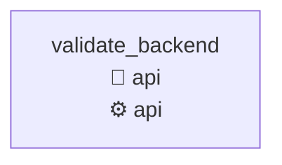

```mermaid
flowchart LR
    step_precond_calendar_writable_1["validate_backend\n📡 api\n⚙ api"]

```

- **Status**: approved
- **Canais**: api
- **Risco**: high
- **Pré-condições**: nenhuma
- **Validações**: replay=true, backend=true