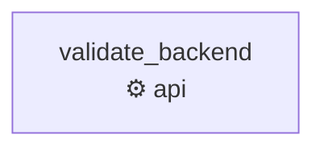

```mermaid
flowchart LR
    step_cap_support_ticket_flow_1["validate_backend\n⚙ api"]

```

- **Status**: draft_ai
- **Canais**: api
- **Risco**: high
- **Pré-condições**: nenhuma
- **Validações**: replay=true, backend=true