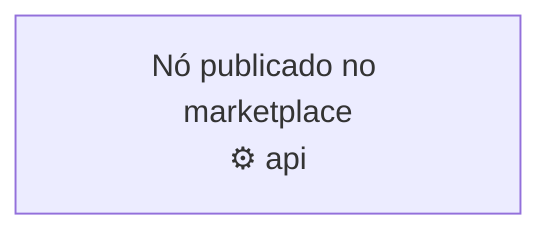

```mermaid
flowchart LR
    step_mkt_001["Nó publicado no marketplace\n⚙ api"]

```

- **Status**: approved
- **Canais**: api
- **Risco**: medium
- **Pré-condições**: Marketplace carregável no tenant; Nó disponível para publicação
- **Validações**: replay=false, backend=true