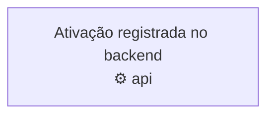

```mermaid
flowchart LR
    step_serv_001["Ativação registrada no backend\n⚙ api"]

```

- **Status**: approved
- **Canais**: api
- **Risco**: medium
- **Pré-condições**: Catálogo de soluções publicado; Tenant autenticado
- **Validações**: replay=false, backend=true