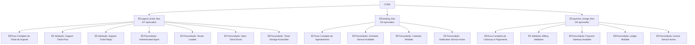

```mermaid
flowchart TD
    v_core["CORE"]
    core_support_ticket_flow["⬜ support_ticket_flow\n0/7 aprovados"]
    v_core --> core_support_ticket_flow
    business_e2e_support_ticket_flow["⬜ Fluxo Completo de Ticket de Suporte"]
    core_support_ticket_flow --> business_e2e_support_ticket_flow
    cap_support_ticket_flow["⬜ Validação: Support Ticket Flow"]
    core_support_ticket_flow --> cap_support_ticket_flow
    cap_support_ticket_reply["⬜ Validação: Support Ticket Reply"]
    core_support_ticket_flow --> cap_support_ticket_reply
    precond_support_ticket_flow_authenticated_agent["⬜ Precondição: Authenticated Agent"]
    core_support_ticket_flow --> precond_support_ticket_flow_authenticated_agent
    precond_support_ticket_flow_tenant_loaded["⬜ Precondição: Tenant Loaded"]
    core_support_ticket_flow --> precond_support_ticket_flow_tenant_loaded
    precond_support_ticket_flow_open_ticket_exists["⬜ Precondição: Open Ticket Exists"]
    core_support_ticket_flow --> precond_support_ticket_flow_open_ticket_exists
    precond_support_ticket_flow_ticket_storage_accessible["⬜ Precondição: Ticket Storage Accessible"]
    core_support_ticket_flow --> precond_support_ticket_flow_ticket_storage_accessible
    core_booking_flow["⬜ booking_flow\n0/4 aprovados"]
    v_core --> core_booking_flow
    business_e2e_booking_flow["⬜ Fluxo Completo de Agendamento"]
    core_booking_flow --> business_e2e_booking_flow
    precond_booking_flow_schedule_service_available["⬜ Precondição: Schedule Service Available"]
    core_booking_flow --> precond_booking_flow_schedule_service_available
    precond_booking_flow_calendar_writable["⬜ Precondição: Calendar Writable"]
    core_booking_flow --> precond_booking_flow_calendar_writable
    precond_booking_flow_notification_service_active["⬜ Precondição: Notification Service Active"]
    core_booking_flow --> precond_booking_flow_notification_service_active
    core_payment_charge_flow["⬜ payment_charge_flow\n0/5 aprovados"]
    v_core --> core_payment_charge_flow
    business_e2e_payment_charge_flow["⬜ Fluxo Completo de Cobrança e Pagamento"]
    core_payment_charge_flow --> business_e2e_payment_charge_flow
    cap_billing_validation["⬜ Validação: Billing Validation"]
    core_payment_charge_flow --> cap_billing_validation
    precond_payment_charge_flow_payment_gateway_available["⬜ Precondição: Payment Gateway Available"]
    core_payment_charge_flow --> precond_payment_charge_flow_payment_gateway_available
    precond_payment_charge_flow_ledger_writable["⬜ Precondição: Ledger Writable"]
    core_payment_charge_flow --> precond_payment_charge_flow_ledger_writable
    precond_payment_charge_flow_invoice_service_active["⬜ Precondição: Invoice Service Active"]
    core_payment_charge_flow --> precond_payment_charge_flow_invoice_service_active

```