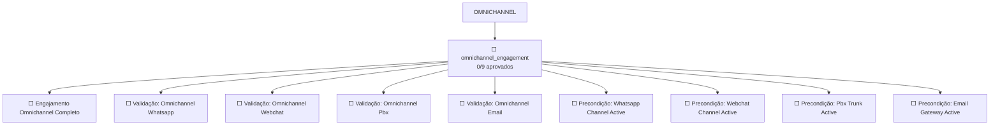

```mermaid
flowchart TD
    v_omnichannel["OMNICHANNEL"]
    omnichannel_omnichannel_engagement["⬜ omnichannel_engagement\n0/9 aprovados"]
    v_omnichannel --> omnichannel_omnichannel_engagement
    business_e2e_omnichannel_engagement["⬜ Engajamento Omnichannel Completo"]
    omnichannel_omnichannel_engagement --> business_e2e_omnichannel_engagement
    cap_omnichannel_whatsapp["⬜ Validação: Omnichannel Whatsapp"]
    omnichannel_omnichannel_engagement --> cap_omnichannel_whatsapp
    cap_omnichannel_webchat["⬜ Validação: Omnichannel Webchat"]
    omnichannel_omnichannel_engagement --> cap_omnichannel_webchat
    cap_omnichannel_pbx["⬜ Validação: Omnichannel Pbx"]
    omnichannel_omnichannel_engagement --> cap_omnichannel_pbx
    cap_omnichannel_email["⬜ Validação: Omnichannel Email"]
    omnichannel_omnichannel_engagement --> cap_omnichannel_email
    precond_omnichannel_engagement_whatsapp_channel_active["⬜ Precondição: Whatsapp Channel Active"]
    omnichannel_omnichannel_engagement --> precond_omnichannel_engagement_whatsapp_channel_active
    precond_omnichannel_engagement_webchat_channel_active["⬜ Precondição: Webchat Channel Active"]
    omnichannel_omnichannel_engagement --> precond_omnichannel_engagement_webchat_channel_active
    precond_omnichannel_engagement_pbx_trunk_active["⬜ Precondição: Pbx Trunk Active"]
    omnichannel_omnichannel_engagement --> precond_omnichannel_engagement_pbx_trunk_active
    precond_omnichannel_engagement_email_gateway_active["⬜ Precondição: Email Gateway Active"]
    omnichannel_omnichannel_engagement --> precond_omnichannel_engagement_email_gateway_active

```